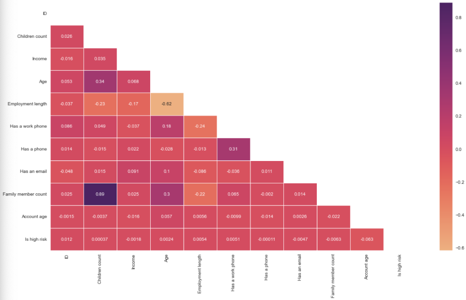

Banner [source](https://banner.godori.dev/)


[](https://github.com/ellerbrock/open-source-badges/)

Badge [source](https://shields.io/)

# Description: A machine learning project that predicts whether a credit card applicant is likely to be classified as high risk based on applicant information. The project includes exploratory data analysis, feature engineering, preprocessing, comparison of multiple classification models, final model testing, and a Streamlit interface.

## Authors

- [@pranav4141](https://www.github.com/pranav4141)

## Table of Contents

  - [Business problem](#business-problem)
  - [Data source](#data-source)
  - [Methods](#methods)
  - [Tech Stack](#tech-stack)
  - [Quick glance at the results](#quick-glance-at-the-results)
  - [Lessons learned and recommendation](#lessons-learned-and-recommendation)
  - [Limitation and what can be improved](#limitation-and-what-can-be-improved)
  - [Run Locally](#run-locally)
  - [Explore the notebook](#explore-the-notebook)
  - [Deployment on streamlit](#deployment-on-streamlit)
  - [App deployed on Streamlit](#app-deployed-on-streamlit)
  - [Repository structure](#repository-structure)
  - [Contribution](#contribution)
  - [License](#license)


## Business problem

This app predicts if an applicant will be approved for a credit card or not. Each time there is a hard enquiry your credit score is affected negatively. This app predict the probability of being approved without affecting your credit score. This app can be used by applicant who wants to find out if they will be approved for a credit card without affecting their credit score.
## Data source

- [Kaggle credit card approval prediction](https://www.kaggle.com/rikdifos/credit-card-approval-prediction)

## Methods

- Exploratory data analysis
- Feature Engineering
- Multivarate correlation
- SMOTE Oversampling
- Select Gradient Boosting
- Model deployment
  
## Tech Stack
- Python (refer to requirement.txt for the packages used in this project)
- Streamlit (interface for the model)
- Data Analysis: Pandas, NumPy, Matplotlib, Seaborn
- Machine Learning: Scikit-learn, Imbalanced-learn, SMOTE, Gradient Boosting, Logistic Regression, Random Forest, Support Vector Machine, Decision Tree, AdaBoost
- Deployment: Streamlit, Github
- Supporting Libraries: Joblib, Requests, SciPy


## Quick glance at the results

Correlation between the features.



Confusion matrix of gradrient boosting classifier.


ROC curve of gradrient boosting classifier.


Top 3 models (with default parameters)

| Model     	                | Recall score 	|
|-------------------	        |------------------	|
| Support vector machine     	| 88% 	            |
| Gradient boosting    	        | 90% 	            |
| Adaboost               	    | 79% 	            |


- ***The final model used is: Gradient boosting***
- ***Metrics used: Recall***
- Why choose precision as metrics:
  Since the objective of this problem is to minimize the risk of credit default for the financial institution, the metrics to use depends on the current economical situation:

  - During the time of a bull market (when the economy is expending), people feel wealthy and usually are employed. Money is usually cheap and the risk of default is low. The financial institution is able to handle the risk of default therefore is not very strict on giving out credit. The financial institution can handle a number of bad clients as long as the vast majority of applicants are good clients (aka those who payback their credit).In this case, having a good recall (sensitivity) is ideal.
  - During a bear market (when the economy is contracting), people loose their jobs and their money through the stock market. Many people struggle to meet their financial obligations. The financial institution therefore tend to be more conservative on giving out credit or loans. The financial institution can't afford to give out credit to clients who won't be able to pay back their credit. The financial institution would rather have a smaller number of good clients even if it means that some good clients where denied credit, and ideally not have any bad client. In this case, having a good precision (specificity) is desirable.

    Note: There is always a trade-off between precision and recall. Choosing the right metrics depends on the problem you are solving.

    Conclusion: In our case, since we are in the longest bull market (not including the March 2020 flash crash), we will use recall as our metric.


## Lessons learned and recommendation

- Based on the analysis on this project, we found out that the education level and type of relationship are the most predictive features to determine if someone makes more or less than 50K. Other features like Capital gain, hours work and age are also usefull. The least usefull features are: their occupation and the workclass they belong to.
- Recommendation would be to focus more on the most predictive feature when looking at the applicant profile, and pay less attention on their occupation and workclass.
## Limitation and what can be improved

- Speed: since the model is stored on AWS S3, it can take some few seconds to load. Solution: cache the model with the Streamlit @st.experimental_singleton for faster reload.
- Dataset used: the dataset used is from 1990, inflation has not been taken into consideration and the countries's economies have changed since then. Solution: retrain with a more recent dataset.
- Hyperparameter tuning: I used RandomeSearchCV to save time but could be improved by couple of % with GridSearchCV.


## Run Locally
Initialize git

```bash
git init
```


Clone the project

```bash
https://github.com/pranav4141/Credit-Card-Approval-Prediction.git
```

enter the project directory

```bash
cd Credit-Card-Approval-Prediction
```

Create a conda virtual environment and install all the packages from the environment.yml (recommended)

```bash
conda env create --prefix <env_name> --file assets/environment.yml
```

Activate the conda environment

```bash
conda activate <env_name>
```

List all the packages installed

```bash
conda list
```

Start the streamlit server locally

```bash
streamlit run cc_approval_pred.py
```
If you are having issue with streamlit, please follow [this tutorial on how to set up streamlit](https://docs.streamlit.io/library/get-started/installation)

## Explore the notebook

To explore the notebook file [here](https://nbviewer.org/github/semasuka/Income-classification/blob/master/Income_Classification.ipynb)

## Deployment on streamlit

To deploy this project on streamlit share, follow these steps:

- first, Push the project files to GitHub.
- Make sure requirements.txt is in the repository root.
- Open Streamlit Community Cloud.
- Connect your GitHub account.
- Select this repository.
- Select the appropriate branch.
- Set the main file to: cc_approval_pred.py
- Deploy the application.

## Repository structure


```

├── assets
│   ├── Credit_card_approval_banner.png       <- banner image used in the README.
│   ├── confusion_matrix.png                  <- confusion matrix image used in the README.
│   ├── environment.yml                       <- list of all the dependencies with their versions(for conda environment).
│   ├── heatmap.png                           <- heatmap image used in the README.
│   ├── roc.png                               <- ROC image used in the README.
|
├── datasets
│   ├── application_record.csv                <- the application record data.
│   ├── credit_record.csv                     <- the credit record data.
│   ├── test.csv                              <- the test data.
│   ├── train.csv                             <- the train data.
│
├── .gitignore                                <- used to ignore certain folder and files that won't be commit to git.
│
│
├── Credit_card_approval_prediction.ipynb     <- main python notebook where all the analysis and modeling are done.
│
│
├── READM◘E.md                                 <- this readme file.
│
│
├── cc☻_approval_pred.py                       <- file with the best model and best hyperparameter with streamlit component for rendering the interface.
│
│
├── requirements.txt                           <- list of all the dependencies with their versions(used for Streamlit ).

```
